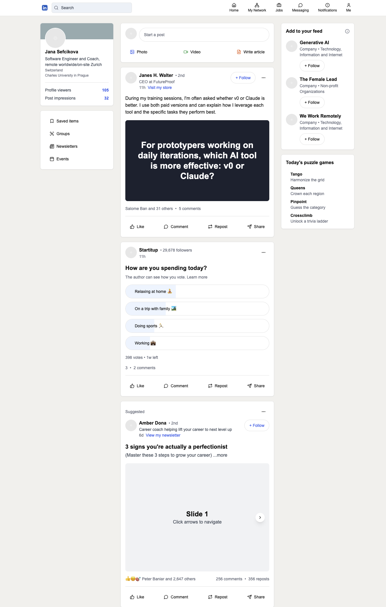
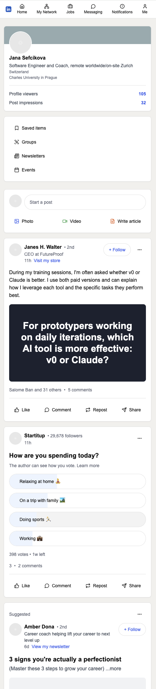
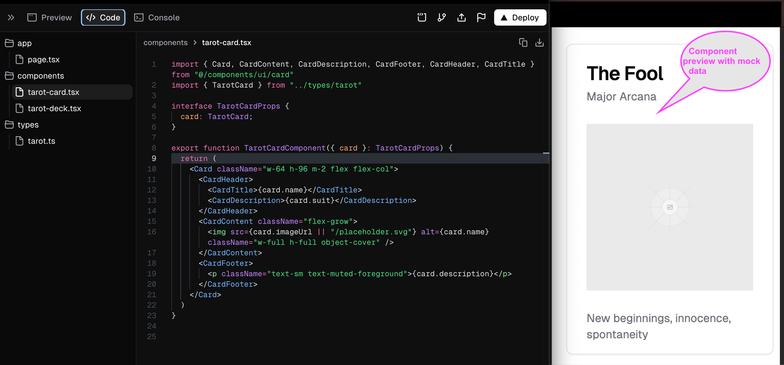
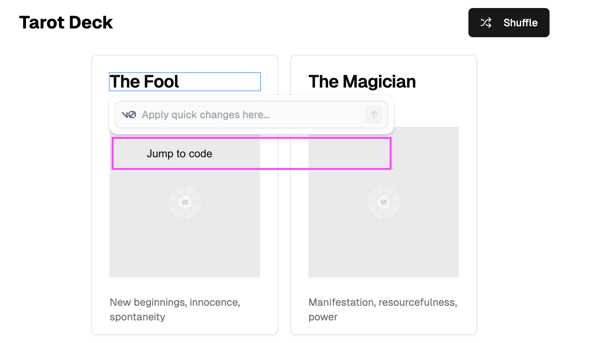

# LinkedIn front page UI mock clone

## Motivation 
I wanted to explore how quickly I can create a LinkedIn front page mock clone. 

## Code generation with v0 
I aimed to see v0's code generation capabilities usings screenshots. 
 
>prompt: Create a UI for the following LinkedIn dashboard.

>context: I added a screenshot of LinkedIn front page covering just one post. I didn't want to try it all at once. 

It generated a decent front page UI but omitted one post in the middle. To address this, I took the a screenshot of an individual post and provided it to v0.

>prompt: Remove component with XYZ. And replace it with a component according this post.
>
>context: I added screenshot of one post.

It generated the post in the middle of the page.

Afterward I did couple visual tweaks.

>Make round corner to all Follow buttons

>Move the profile avatar up by 100% of the picture height's.

>Replace the missing logo with image on this url, size it appropriately https://static.vecteezy.com/system/resources/previews/018/910/721/large_2x/LinkedIn-logo-LinkedIn-symbol-LinkedIn-icon-free-free-vector.jpg 

Credit for LinkedIn belong to [Vecteezy](href="https://www.vecteezy.com/free-png/LinkedIn-icon)

Then I wanted to add more post types. Before doing that I sensed that is good time to clean code a bit and to have separate components for each variant. I wanted open up the door for generalisation, but I didn't do it in this round. 

>Extract code for this post to separate component.

Next, I wanted to add another post variants, such as a post with a poll. 

>Add another type of post below the one we have
> 
>Context: I added screenshot of post with poll.

Towards the end, I added post containing slider (AI called it carousel). 

> Prompt: Generate another type of post with the ability to navigate to the next slide. For now, instead of pictures just add some placeholder.
>  
>Context: I added screenshot of post with slider.

Finally, I performed some minor visual cleanup:

> Separate all menu items on the right side to separate component
> Distribute uniformly items in NavigationMenu

There were a few more similar prompts. 

Refactor time
> Reorganize code, put all variants of posts to post-variants directory

At the very end, I manually mocked the content of posts. Could have try to use just AI...

## Output

## UI Usage
The UI is currently static and doesn’t perform any actions (no add post functionality). However, I plan to continue working on it and see how far I can take this reverse-engineering experiment.

The carousel in the post worked out of the box.

## Screenshots

### Desktop

### Mobile

## Bugs
- Date-picker issue: The project initially failed due to a date-picker bug but started working after upgrading to latest version
- Carousel Post Issue: carousel-post.tsx was not a Next.js Client component. I converted it to resolve the issue.

## Learnings
1. Iterative screenshot-ing of components, cleaning of directory worked well for generating UI and having control. I wasn't checking code, but this approach would allow me to do it easier. 
2. Splitting code early and introducing micro clean coding practice helped me talk with AI effectively. I could start to use name of components etc and find them. It also guided the AI to focus on smaller, more manageable chunks of code during updates.
3. I feel certain unease in doing this project - as it is a "AI copy cut" based on the design. However, this project is geared towards playing with generators and AI and showcasing learnings for others. So, I considered it acceptable to publish this repository for educational purposes. However, it’s important for me to highlight that we should use this approach for inspiration but perform our own implementation and design. I welcome discussions on this topic.
4. Even though iterative approach is great, I think that I need to remind myself that I should do big experiments too with AI from time to time. 

## Proposals of v0 improvements
I shared two improvement ideas with the v0.dev Discord community today.

### 🦋 Component preview with mock data
Idea: When the user is in a file (e.g., tarot-card.tsx), she coule be able to see a preview of the component with AI providing mock data for its properties." As far as I know such feature doesn't exist in any IDE that I have ever used. 

### 🦋 🐸  Jump to code from visual element with menu/shortcut 
Idea: Users could be able to quickly jump to the source file of a visual element by using a menu or shortcut.

Motivation: In the image below, the user has focus on the element labeled "The Fool." For rapid prototyping, it would be fantastic to quickly navigate to the file defining the focused element. Additional functionality like direct inline text editing would be amazing."

