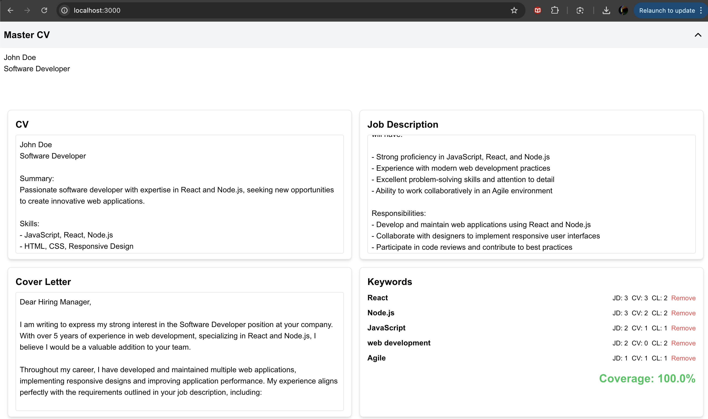

# Description 
Today I tested two things :
- framing requirements with Claude, Chatgpt and v0
- got usable version with v0 presented here (except bug with directory structure easily fixed) but also some version with Cluade (just in UI)

# First prompt 
>Create a dashboard with 5 areas. At the top (heading) there is an input area for massive cv. The input area is scrollable. There is a 4 pages long demo CV for software developers. Height of top heading should be 1/5 of screen height with minimum. The input area should be collapsible.
> 
> Now under it, there are 4 quadrants, starting with Q1 in the top left corner and Q2 next to it, Q3 below Q1 and Q4 on the left of Q3. Horizontal and vertical separators should be movable to stretch the area.
>
>Now In Q2, there is a section named "Job description". Users can paste their job description. Input area is scrollable. Users can highlight any "keyword" that he want to have in CV that will be developed in Q1 and Cover letter in Q2. When the user highlights the word, the keyword is added to the keywords section in Q4. This will be defined later.
>
> In Q4 we see a list of keywords highlighted in the Job description. Keywords are magical. Next to each keyword there should be count of occurrence in job description, count of occurrence in CV and count of occurrence in Cover letter.
It is also possible to remove interest in keywords.
> 
> In Q4 we should see a brief statistic on how many highlighted keywords are being used in CV and cover letter.
>
> Add dummy default content to Q4 with a fake job.
>
> In Q3 users can edit cover letters. He can paste it there.
>
> Now ask me any question before proceeding to creating a react app.

## Output
After brief conversation, dropping draggable feature, v0 made the UI.
Fix of bug was easy and I reported it.



## Learnings
- writing of the first prompt took more than 15 minutes -> so I tried today chatgpt voice, maybe I can use it for writing prompts next time but even better draw UI and go maybe from there
- creating space for questions seemed as good practice for claude and v0, they had similar questions (v0 had 2x more questions for first prompt)
- unconventional UI features should be tested solo with finding good prompt
 
# Technical details

This is a [Next.js](https://nextjs.org) project bootstrapped with [`create-next-app`](https://nextjs.org/docs/app/api-reference/cli/create-next-app).

## Getting Started

First, run the development server:

```bash
npm run dev
# or
yarn dev
# or
pnpm dev
# or
bun dev
```

Open [http://localhost:3000](http://localhost:3000) with your browser to see the result.

You can start editing the page by modifying `app/page.tsx`. The page auto-updates as you edit the file.

This project uses [`next/font`](https://nextjs.org/docs/app/building-your-application/optimizing/fonts) to automatically optimize and load [Geist](https://vercel.com/font), a new font family for Vercel.

## Learn More

To learn more about Next.js, take a look at the following resources:

- [Next.js Documentation](https://nextjs.org/docs) - learn about Next.js features and API.
- [Learn Next.js](https://nextjs.org/learn) - an interactive Next.js tutorial.

You can check out [the Next.js GitHub repository](https://github.com/vercel/next.js) - your feedback and contributions are welcome!

## Deploy on Vercel

The easiest way to deploy your Next.js app is to use the [Vercel Platform](https://vercel.com/new?utm_medium=default-template&filter=next.js&utm_source=create-next-app&utm_campaign=create-next-app-readme) from the creators of Next.js.

Check out our [Next.js deployment documentation](https://nextjs.org/docs/app/building-your-application/deploying) for more details.
