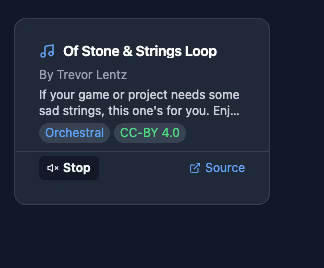
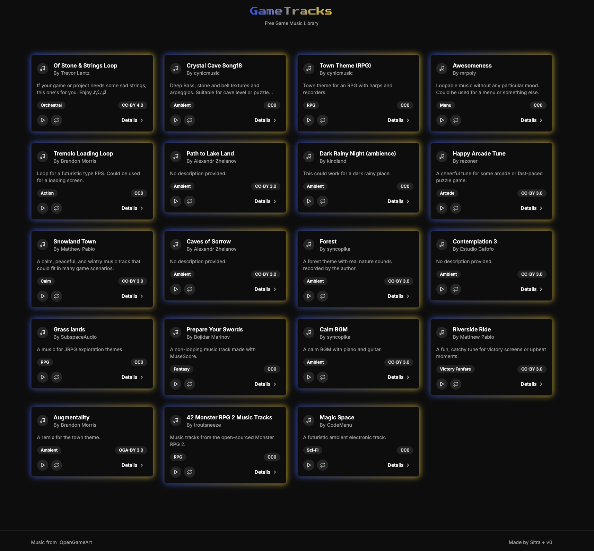
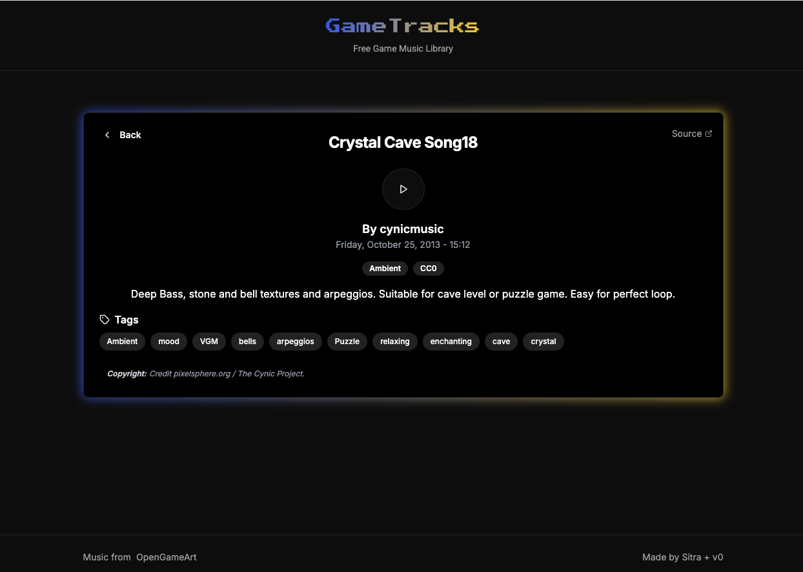
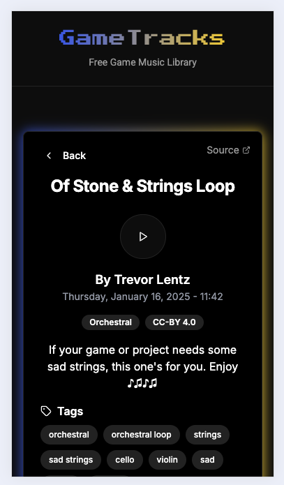
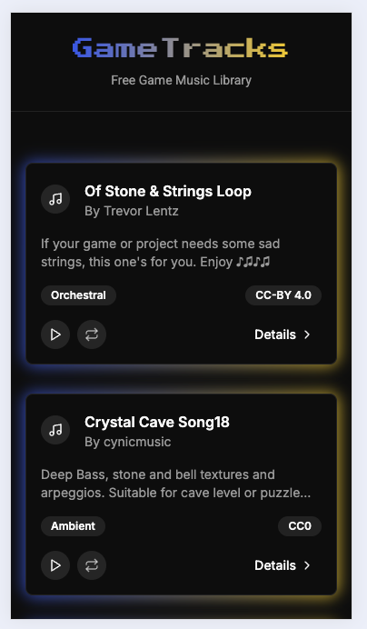

# Game Tracks

## Motivation
For my [musiker](../musiker) I needed some data as presenter used his own. I have enbarqued on a journey to find a some free data and create json data set that can be used in the app and by others. 

At the end it was exhausting, as I did it manually and had to check whether ChatGPT helped me clean them. 

Data can be found in [songs.json](./data/songs.json).

## Code generation with v0
Project was generated with v0.dev. 

Some initial prompts 

> Use following data. Make cards of songs next to each other in preview mode and when I click on it, I will see all details. Use slug for url.

Context: I added file  [songs.json](./data/songs.json) to the context.

I played also with similar prompt in Claude so in the next round I gave v0 screenshot from Claude.

>Great, let's make preview better

Note: I added as context file [Claude_song_card_preview.png](./assets/Claude_song_card_preview.png)
 


## Output
With some iteration I created functional app. 

## Usage
After running localhost, user can 
- see list of songs
- click on the song card
- play song 
- press loop button to loop song

## Screenshots

### Desktop



### Mobile 



## Learnings
- **Data Acquisition**:
    - Obtaining good and valid data is time-consuming. For instance, I spent around 2 hours grabbing content from a site and converting it to JSON (using ChatGPT), followed by an additional hour clicking and verifying URLs, checking attribution instructions, and validating tags.
    - This process still required manual corrections, so automating parts of it could be beneficial.

- **ChatGPT Usage**:
    - Discovered that ChatGPT can convert text from images into editable text, which was helpful.

- **Forking in v0**:
    - Initially planned to visualize a song when it was playing. To handle this, I forked the project, which seemed like a good approach at the time.
    - However, I quickly realized it required more effort than anticipated, and the changes didn't resolve themselves, so I reverted the changes.

- **Efficiency with Tailwind**:
    - Certain tasks took longer because of inexperience with modifying code using Tailwind CSS. Improving speed and familiarity with Tailwind would be valuable moving forward.


# Tech documentation

This is a [Next.js](https://nextjs.org) project bootstrapped with [`create-next-app`](https://nextjs.org/docs/app/api-reference/cli/create-next-app) .

## Getting Started

First, run the development server:

```bash
npm run dev
# or
yarn dev
# or
pnpm dev
# or
bun dev
```

Open [http://localhost:3000](http://localhost:3000) with your browser to see the result.

You can start editing the page by modifying `app/page.tsx`. The page auto-updates as you edit the file.

This project uses [`next/font`](https://nextjs.org/docs/app/building-your-application/optimizing/fonts) to automatically optimize and load [Geist](https://vercel.com/font), a new font family for Vercel.

## Learn More

To learn more about Next.js, take a look at the following resources:

- [Next.js Documentation](https://nextjs.org/docs) - learn about Next.js features and API.
- [Learn Next.js](https://nextjs.org/learn) - an interactive Next.js tutorial.

You can check out [the Next.js GitHub repository](https://github.com/vercel/next.js) - your feedback and contributions are welcome!

## Deploy on Vercel

The easiest way to deploy your Next.js app is to use the [Vercel Platform](https://vercel.com/new?utm_medium=default-template&filter=next.js&utm_source=create-next-app&utm_campaign=create-next-app-readme) from the creators of Next.js.

Check out our [Next.js deployment documentation](https://nextjs.org/docs/app/building-your-application/deploying) for more details.
