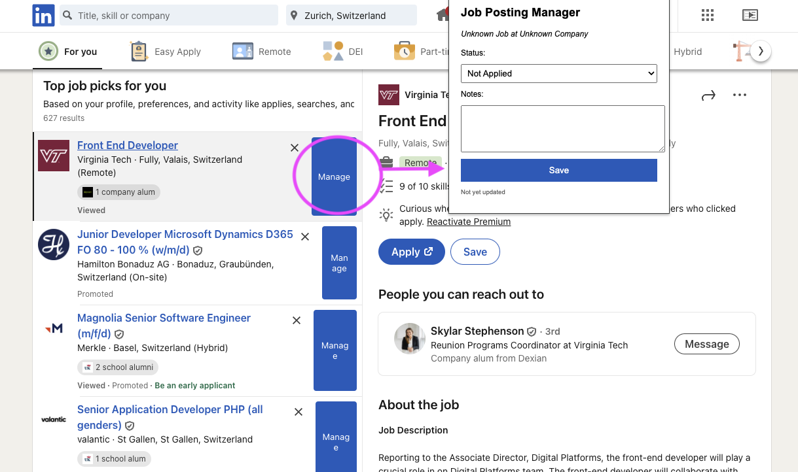

# AI generated Job posting manager - chrome extension 

## Description
Repo generated with v0, downloaded, loaded to browser.

### Code generation in v0
Prompt "I want to build Google Chrome extension that allows me to manage job postings. For example when I go to Linkedin to see job posts, I want to be able add additional flags like applied or note to job preview."

### Output
Generated repo contained the files that are currently present in the codebase plus lot of clutter for react etc. 
After removing the clutter, the extension was tested in Google Chrome by 
- Going to chrome://extensions/
- Enabling developer mode
- Loading unpacked extension
- Selecting the folder containing the extension
- Opening linkedin.com/jobs

Code logic wasn't reviewed or modified, except tash cleaning.  

### Preview

