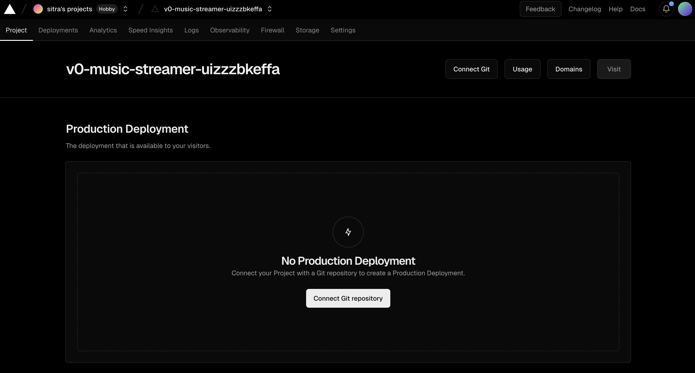
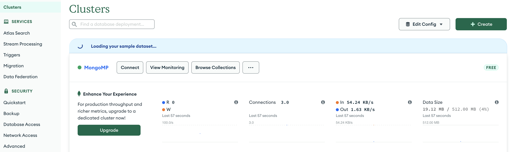
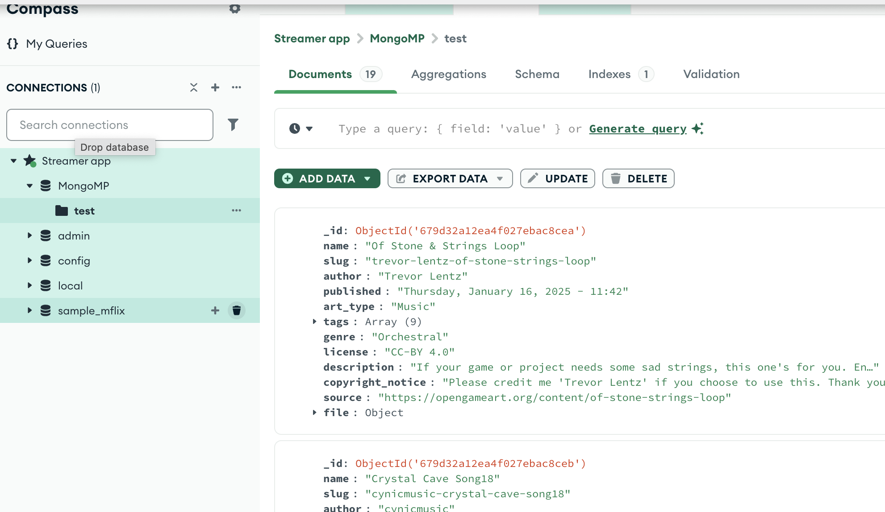
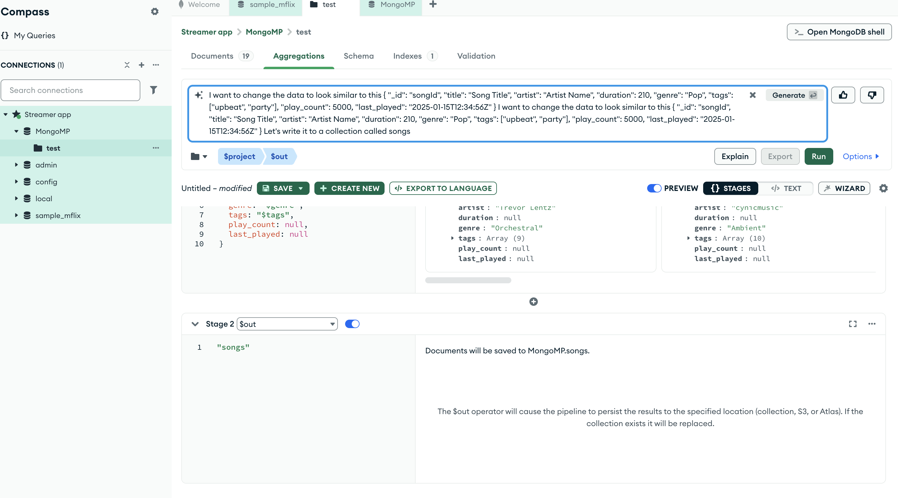
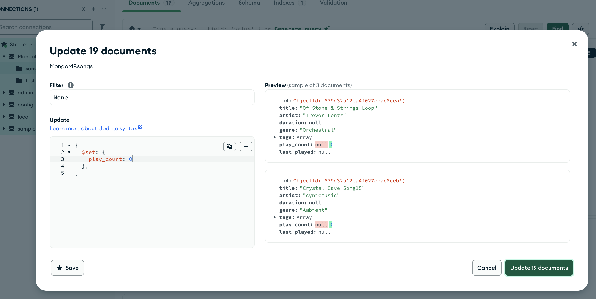

# Musiker
Musiker repo is an attempt to reproduce streaming platform using almost 0 zero code with v0.dev and mongoDB loosely following [this AI live show](https://www.linkedin.com/events/7284721434587766784/about/). 

## AI Chats for live sessions
- [Chat for MDB Schema Builder](https://v0.dev/chat/dark-mode-design-concept-GxqJl1Rh5sc?b=b_WZYUXs2SA2j)
- [Chat in v0](https://v0.dev/chat/dark-mode-design-concept-GxqJl1Rh5sc?b=b_WZYUXs2SA2j)

## Install or setup account
- [v0.dev](https://v0.dev)
- [MDB Schema Builder](https://mdb.link/mdb-schema-builder) 
- [MongoDB Atlas](https://www.mongodb.com/try)
- install MongoDB GUI needs
- install npm
- install node.js 
- install mongo : npm install mongodb

## Song data set
The demo is using data set of songs hosted on S3. To have some songs data, I created _songs.json_ that should fit purpose. Thanks to [OpenGameArt](https://opengameart.org/) and authors for the songs.
To check and clean data it was easier to directly make web for it from json and at the end I successfully side-tracked to spent time on it :) However I made my first better website [game-tracks](../game-tracks/README.md).

## Creating v0.dev project
Create new project in v0.dev.
Add following prompt to instruction :
>This project is aiming to build a music streaming platform. Use Next.js 14 with app router. Keep code clean and with comments on important sections. Keep components under 500 lines. We will use MongoDB Driver for the project, but initially we will start with json mock data.
> 

### View in vercel
To see the project in vercel 




## Setup cluster in Mongo 
- Navigate to [MongoDB Atlas](https://www.mongodb.com/try) to try MongoDB Atlas.
- Create a new cluster.
- When prompted for a connection method, select MongoDB driver (we will need to install it e.g. npm install mongodb)



## Modeling in MDB Schema Builder

>I want to start brainstorming a schema for my music streaming platform, don't jump to conclusions and let's discuss potential schema.

Please note that output was significantly different as in the demo. 

Here is brief summary of what we want:

- *Entities*: user, artist, song, playlist
- *Features*: 
  - A user has a history of last played songs
  - A user can have many playlists, an artist can have many songs, and a song can belong to many playlists
  - The platform should be read-heavy, with loading song details being critical
  - Search functionality by genre, artist, or song name (but this will be implemented later)
  
> Can you generate an md file to present it to my AI coder. Focus on specifying the requirements and different views that we need.
> 


## Import data 
 - create database MongoMP within cluster
 - my step: pasted songs.json to MDB schema and asked it for cleaning 

- Import 'songs.json' data into test collection


### Capturing requirements in MDB 
In MDB: 
> Can you generate an md file to present it to my AI coder. Focus on specifying the requirements and different views that we need.

This file as backup is stored in MDBRequirements.md

### Schema adaptation in Compass
- In Compass, select test db, and in the AI row the presenter wrote
> I want to change the data to look similar to this 
> {
"_id": "songId",
"title": "Song Title",
"artist": "Artist Name",
"duration": 210,
"genre": "Pop",
"tags": ["upbeat", "party"],
"play_count": 5000,
"last_played": "2025-01-15T12:34:56Z"
}
> Let's write it to a collection called songs

Note: this json is a copy of a sample song representation from MDBRequirements's Songs collection.



Let's update play_count to zero.



I updated also last_played field so that it is not null. Your data might be different. 

## V0 my prompts 

> Buld Musiker app, that streams game tracks. List all songs on the main page that are in file songs.json. Add background inspired by provided gradient. Make responsive grid of song cards and allow playing of songs in url.
> We will later connect it to mongodb but now use mock songs.
As context files I added songs.json and background.

> Please list all songs in songs.json list that I provided and show them in cards in exactly same way as the one sample song

> I want to create a mock user management for my application. The user should look like 
```json
{
  "_id": "userId",
  "name": "John Doe",
  "email": "john.doe@example.com",
  "likes": ["songId1", "songId2"],
  "playlists": [
    {
      "playlist_id": "playlistId1",
      "name": "Chill Vibes",
      "song_ids": ["songId3", "songId4"]
    }
  ],
  "last_played": [
    {"song_id": "songId5", "timestamp": "2025-01-15T12:00:00Z"},
    {"song_id": "songId2", "timestamp": "2025-01-14T18:30:00Z"}
  ]
}
```

I learnt that for v0 for my case, it completely replaced previous app and created 
just user management app. 

So I changed it to 

> I want to add a mock user management for my application. The user should look like this document. 
```json
{
  "_id": "userId",
  "name": "John Doe",
  "email": "john.doe@example.com",
  "likes": ["songId1", "songId2"],
  "playlists": [
    {
      "playlist_id": "playlistId1",
      "name": "Chill Vibes",
      "song_ids": ["songId3", "songId4"]
    }
  ],
  "last_played": [
    {"song_id": "songId5", "timestamp": "2025-01-15T12:00:00Z"},
    {"song_id": "songId2", "timestamp": "2025-01-14T18:30:00Z"}
  ]
}
```
## Import Data
- Create a database named `MongoMP` within the cluster.
- My step: Pasted `songs.json` into the MongoDB schema and requested it to clean the data.

- Import the `songs.json` data into the `test` collection:
  

---

### Capturing Requirements in MongoDB
In MongoDB:
> Can you generate a markdown file to present it to my AI coder? Focus on specifying the requirements and the different views needed.

This file has been stored as a backup in `MDBRequirements.md`.

---

### Schema Adaptation in Compass
- In Compass, select the `test` database, and in the `AI` row, the presenter wrote:
> I want to reshape the data to look similar to this:
> ```json
> {
>   "_id": "songId",
>   "title": "Song Title",
>   "artist": "Artist Name",
>   "duration": 210,
>   "genre": "Pop",
>   "tags": ["upbeat", "party"],
>   "play_count": 5000,
>   "last_played": "2025-01-15T12:34:56Z"
> }
> ```
> Let's write this schema to a collection called `songs`.

**Note**: This JSON is a representation of a sample song based on the `Songs` collection in `MDBRequirements`.


After reshaping the schema, let's update the `play_count` field to `0`:


Additionally, I updated the `last_played` field so that it is not null. Your data might be different.

---

## V0 Prompts

> Build a "Musiker" app that streams game tracks. List all songs from the `songs.json` file on the main page. Add a background inspired by the provided gradient. Design a responsive grid of song cards and allow users to play songs via URLs.  
> We will later connect the app to MongoDB, but for now, use mock songs.  
> As context files, I added `songs.json` and `background`.

---

### Additional Prompt 1
> Please list all songs from the provided `songs.json` file and display them as cards in exactly the same way as the provided sample song.

---

### Additional Prompt 2
> I want to create a mock user management system for my application. The user schema should look like this:
```json
{
  "_id": "userId",
  "name": "John Doe",
  "email": "john.doe@example.com",
  "likes": ["songId1", "songId2"],
  "playlists": [
    {
      "playlist_id": "playlistId1",
      "name": "Chill Vibes",
      "song_ids": ["songId3", "songId4"]
    }
  ],
  "last_played": [
    { "song_id": "songId5", "timestamp": "2025-01-15T12:00:00Z" },
    { "song_id": "songId2", "timestamp": "2025-01-14T18:30:00Z" }
  ]
}
```

In V0 of my case, it completely replaced the previous app and created only the user management app.

---

### Updated Prompt
> I want to **add** mock user management to my application. The `user` document should look like this:
```json
{
  "_id": "userId",
  "name": "John Doe",
  "email": "john.doe@example.com",
  "likes": ["songId1", "songId2"],
  "playlists": [
    {
      "playlist_id": "playlistId1",
      "name": "Chill Vibes",
      "song_ids": ["songId3", "songId4"]
    }
  ],
  "last_played": [
    { "song_id": "songId5", "timestamp": "2025-01-15T12:00:00Z" },
    { "song_id": "songId2", "timestamp": "2025-01-14T18:30:00Z" }
  ]
}
```

### Adding indices in Compass

