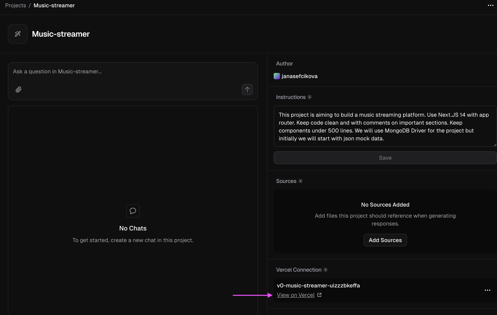

# Musiker
Musiker repo is an attempt to reproduce streaming platform using almost 0 zero code with v0.dev and mongoDB loosely following [this AI live show](https://www.linkedin.com/events/7284721434587766784/about/). 

## Install or setup account
- [v0.dev](https://v0.dev)
- [MDB Schema Builder](https://mdb.link/mdb-schema-builder) 
- [MongoDB Atlas](https://www.mongodb.com/try)
- install MongoDB GUI needs
- install npm
- install node.js 
- install mongo : npm install mongodb

## Song data set
The demo is using data set of songs hosted on S3. To have some songs data, I created _songs.json_ that should fit purpose. Thanks to [OpenGameArt](https://opengameart.org/) and authors for the songs.
To check and clean data it was easier to directly make web for it from json and at the end I successfully side-tracked to spent time on it :) However I made my first better website [game-tracks](../game-tracks/README.md).

## Creating v0.dev project
Create new project in v0.dev.
Add following prompt to instruction :
>This project is aiming to build a music streaming platform. Use Next.js 14 with app router. Keep code clean and with comments on important sections. Keep components under 500 lines. We will use MongoDB Driver for the project, but initially we will start with json mock data.
> 

### View in vercel
To see the project in vercel 

## Setup cluster in Mongo 
- Navigate to [MongoDB Atlas](https://www.mongodb.com/try) to try MongoDB Atlas.
- Create a new cluster.
- When prompted for a connection method, select MongoDB driver (we will need to install it e.g. npm install mongodb)

## Modeling in MDB Schema Builder

>I want to start brainstorming a schema for my music streaming platform, don't jump to conclusions and let's discuss potential schema.

Please note that output was significantly different as in the demo. 

Here is brief summary of what we want:

- *Entities*: user, artist, song, playlist
- *Features*: 
  - A user has a history of last played songs
  - A user can have many playlists, an artist can have many songs, and a song can belong to many playlists
  - The platform should be read-heavy, with loading song details being critical
  - Search functionality by genre, artist, or song name (but this will be implemented later)
