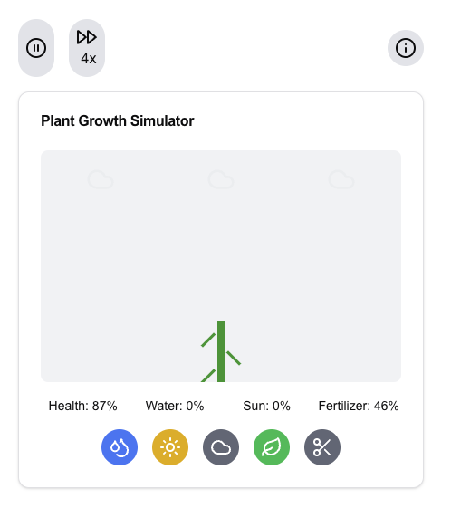
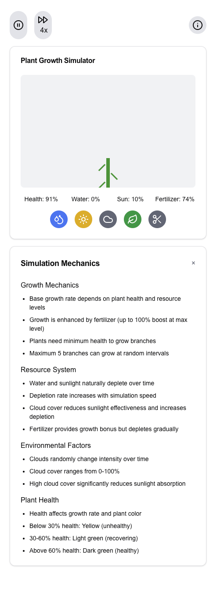

# Plant Simulator App and sample of generating project for Claude code

This project was created using a combination of prompts in Claude and ChatGPT. Due to limitations in Claude, where downloading the entire source code is not possible, I asked it to summarize the steps required to create the project. After running out of credit in Claude, I took the summarized steps and used ChatGPT to generate a bash script that automates the project setup, and I generalized it further.

## Claude Prompts
I asked Claude to create an app based on two simple prompts:
> Make an app that simulates the growth of a plant.

> First, add a speed button similar to video controls (outside of the main frame to the app controls section). Let's call the section with mechanics the 'mechanics section'. Add clouds to mechanics. Also, add fertilizer.

The code generated by Claude can be found in [claude-code.txt](claude-code.txt) file. 

## Run App
You can see the app by running it as follows:
1. `cd plant-simulator`
2. `npm run dev`

The _plant-simulator_ project was created by running [create-app.sh](create-app.sh) script. 
```bash
./create-app.sh plant-simulator
```

The steps how this script was created is summarised below. 

## Screenshots




# How to Create Your Own Project for Claude code
Claude usually creates one big file with one or many components. What if we want to run this code locally? We can't download the codebase as in v0.

Here I provide a step-by-step guide on how I created the `create-app.sh` script that did it for me.

## Creating an App for Claude Code

1. **Initial Steps in Claude:**
   Ask Claude to summarize the steps required to create the project.

   Here is what I did in my case:
   > Tell me the step-by-step process of how to create a new project that will contain the PlantGrowthSimulator component.

   Claude provided a detailed list of steps to set up the project. I ran out of Claude credit, so I copied all the steps and put them into ChatGPT. I usually did the project setup manually, but this time I got an idea and asked GPT to create a script for me from those steps.

2. **Generating the Script in ChatGPT:**
   I used ChatGPT to create a bash script (`create-app.sh`) that automates the project setup based on a copy of the steps provided by Claude.
   > Create a bash script that does all the following steps:
   > I'll guide you through creating a new React project that includes the PlantGrowthSimulator component:
   > Create a new Next.js project with Tailwind CSS:
   > `npx create-next-app@latest plant-simulator --typescript --tailwind --eslint`
   > `cd plant-simulator`
   > Install required dependencies:
   > ... rest of the steps from Claude

### Creating Setup Script
I copied the script content to `create-app.sh` and made some adjustments to ensure it works correctly. I pasted the code from Claude into `claude-code.txt` (note: it was necessary to add "use client" at the top). Now we just needed to update the setup script so that it also places `claude-code.txt` into the appropriate file, so I added it to the script.

After I decided to have it more generic and so the script takes the name of the output project as param.

### Running the Script:**
The project can be created by running the `create-app.sh` script with the component content from `claude-code.txt`.

1. Ensure you have the necessary dependencies installed (e.g., Node.js, npm).
2. Run the `create-app.sh` script with the desired project name:

```bash
./create-app.sh <project-name>
```

This will create a new Next.js project from scratch with the specified name, set up the required dependencies, and include the PlantGrowthSimulator component.
