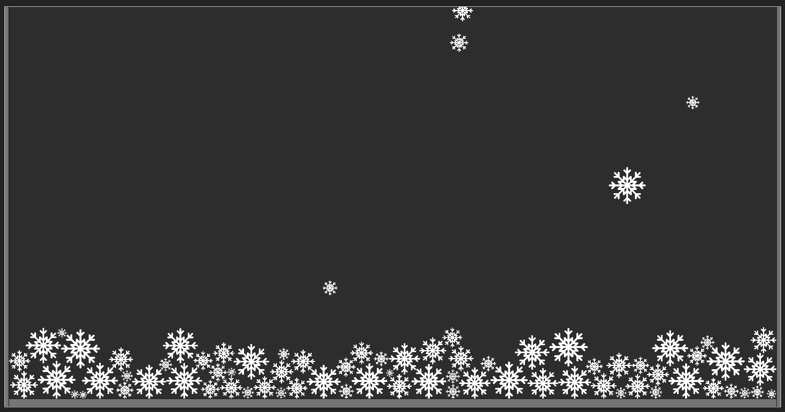
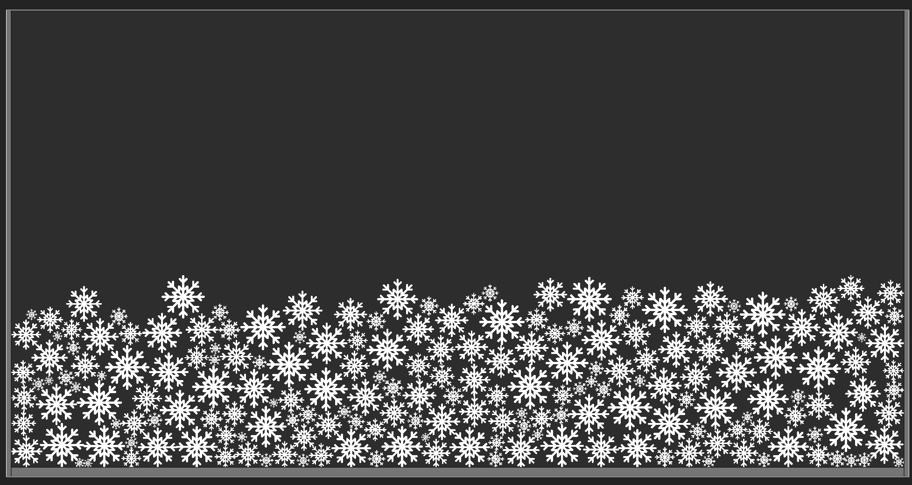

# Falling Snow Animation

This project demonstrates a simple iterative approach to creating a falling snow animation using JavaScript and the p5.js library. The code was generated step-by-step with the help of AI to craft a visually appealing animation of snowfall. Each step of the development process has been captured in separate files, starting from basic implementations to the final animation. These intermediate steps are saved in files like falling-circles1.html, falling-circles2.html, and so on, leading up to the final falling-snow.html file. 

## Final File
The final implementation of the falling snow animation resides in the `falling-snow.html` file.

---

## Prerequisites
To run the final file `falling-snow.html` without encountering CORS (Cross-Origin Resource Sharing) issues when loading resources (such as images), it is necessary to serve the file via a local server. Rest of files can be loaded without problem.

The instructions below explain how to run the project using WebStorm's built-in server.

---

## Running the Project in WebStorm

1. Open the project in **WebStorm**.
2. Locate the `falling-snow.html` file in the project directory.
3. Right-click on `falling-snow.html` and select **Run 'falling-snow.html'**.
4. WebStorm will start its internal HTTP server and open the file in your default web browser.
5. If the file does not automatically open, copy the provided URL (e.g., `http://localhost:63342/`) from WebStorm's terminal and paste it into your browser.

---

## Technologies Used
- **p5.js**: A JavaScript library for creative coding and visual arts projects.
- Iterative development with AI assistance.

---

## Notes
- Directly opening the `falling-snow.html` file in a browser (via `file://`) will result in a CORS error due to modern browser security policies. Running the file in a local server (e.g., WebStorm built-in server) resolves this issue.

---

Feel free to modify and improve this animation further. Happy coding!

## Resources

- The `snowflake.svg` used in this project was downloaded from [svgrepo](https://www.svgrepo.com/svg/77656/snowflake) and has **CC0 License** 
