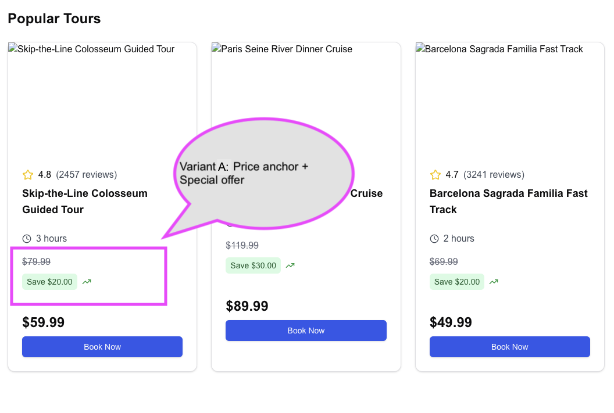
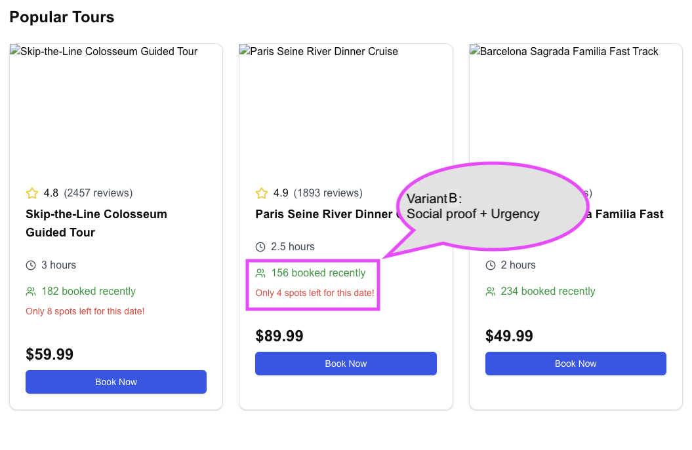

# Tour preview ab-testing with Next on client side

## Motivation
I was curious how A/B testing can be done with React. 

I asked Claude to give me some ideas and this project shows client side A/B testing without any library.

## Code generation with Claude

> #### Claude prompt
> Make an app listing travel tours previews as in GetYourGuide. Create artificial data for each tour. Now we want A/B test two features .
Research the web and propose two best approaches to invite users to explore or book tours more.
Implement it with React.
Summarise proposed technical options used for A/B react testing.

Claude suggested:

>First, let's identify two features to A/B test based on common travel booking patterns:
>
> Version A: Social proof + Urgency (showing number of recent bookings and spots left)
Version B: Price anchor + Special offer (showing original price and discount)

## Output 
Claude generated working code for the prompt that is available in first commit in this repository in the Page.tsx. 

However, Claude doesn't support downloading whole solution. 

But it can be prompted to give step-by-step instructions. I used "Generate step-by-step guide how to build project with this app. Include npm steps".

This prompt lead Claude to refactor code even more, he created instructions. I dropped this, as for prototyping we don't need clean architecture. 

It was enough create Next.js project and install couple libraries that he suggested. 

The generated project worked however it would be necessary to solve bug _"Hydration failed because the server rendered HTML didn't match the client."_ due to random variant selection.

## Usage 
After running localhost, use Refresh to see different variants for the same tour preview. 

## Screenshots 

### Variant A : Price anchor + Special offer


### Variant B : Social proof + Urgency


## Learnings
- Ask Claude for instruction to build project
- Restrict project generation to use minimal count of libraries 
- Claude can be very effective to show variants and would be great to micro-test components variants.

# Tech documentation

This is a [Next.js](https://nextjs.org) project bootstrapped with [`create-next-app`](https://nextjs.org/docs/app/api-reference/cli/create-next-app) .

## Getting Started

First, run the development server:

```bash
npm run dev
# or
yarn dev
# or
pnpm dev
# or
bun dev
```

Open [http://localhost:3000](http://localhost:3000) with your browser to see the result.

You can start editing the page by modifying `app/page.tsx`. The page auto-updates as you edit the file.

This project uses [`next/font`](https://nextjs.org/docs/app/building-your-application/optimizing/fonts) to automatically optimize and load [Geist](https://vercel.com/font), a new font family for Vercel.

## Learn More

To learn more about Next.js, take a look at the following resources:

- [Next.js Documentation](https://nextjs.org/docs) - learn about Next.js features and API.
- [Learn Next.js](https://nextjs.org/learn) - an interactive Next.js tutorial.

You can check out [the Next.js GitHub repository](https://github.com/vercel/next.js) - your feedback and contributions are welcome!

## Deploy on Vercel

The easiest way to deploy your Next.js app is to use the [Vercel Platform](https://vercel.com/new?utm_medium=default-template&filter=next.js&utm_source=create-next-app&utm_campaign=create-next-app-readme) from the creators of Next.js.

Check out our [Next.js deployment documentation](https://nextjs.org/docs/app/building-your-application/deploying) for more details.
